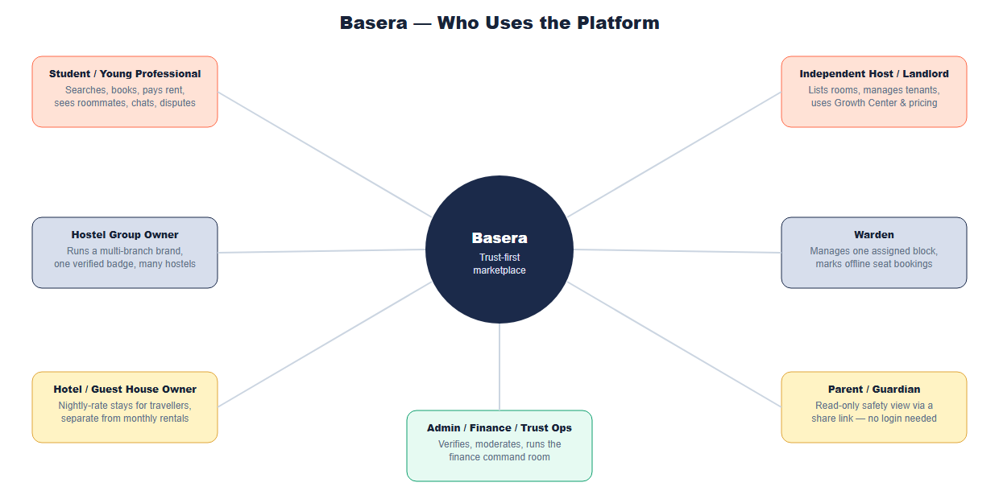
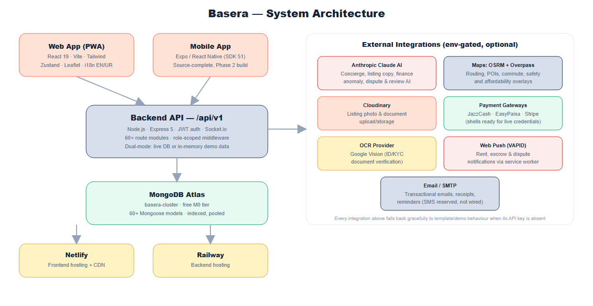
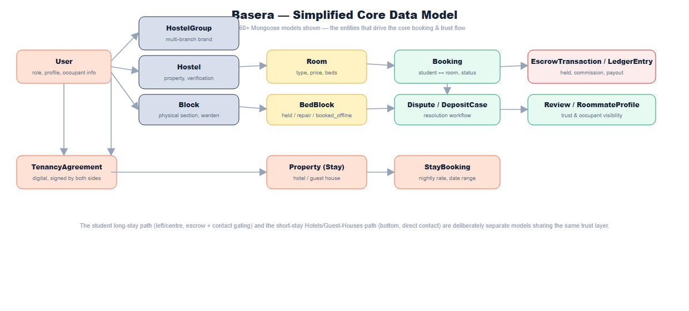
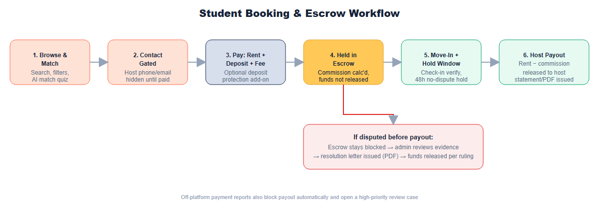
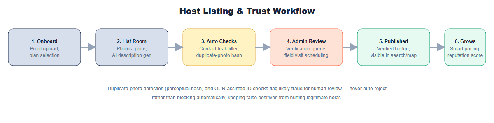
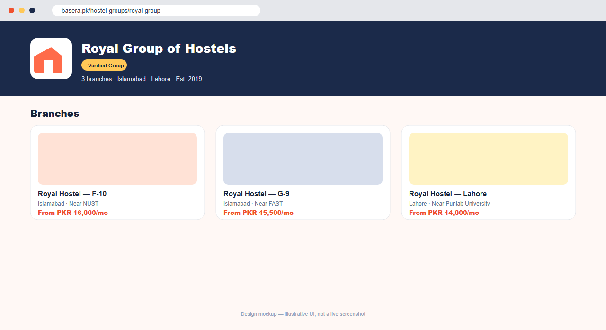
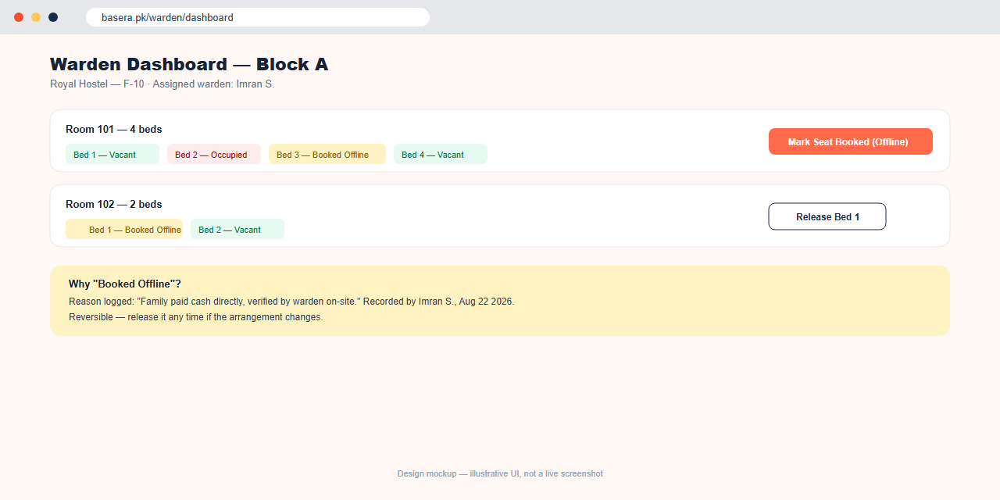
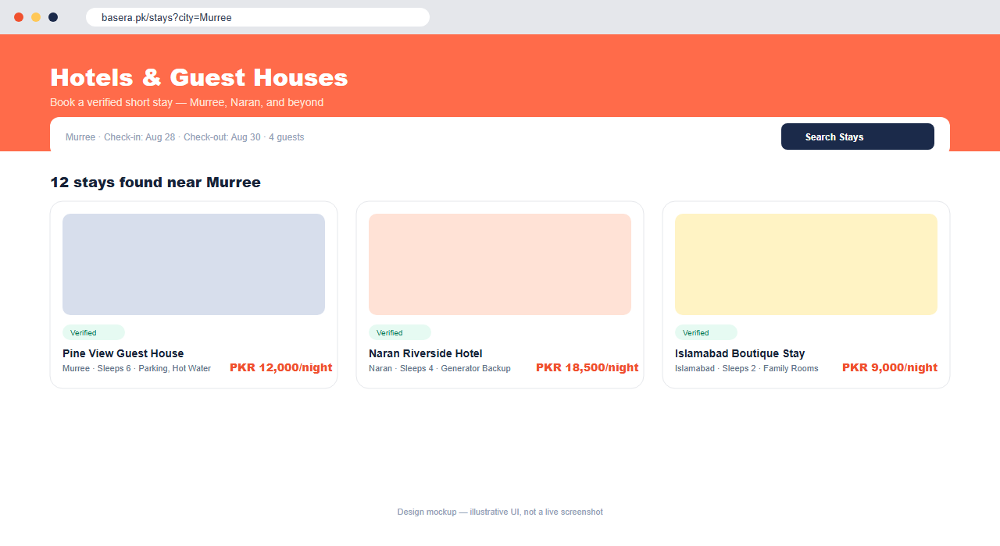
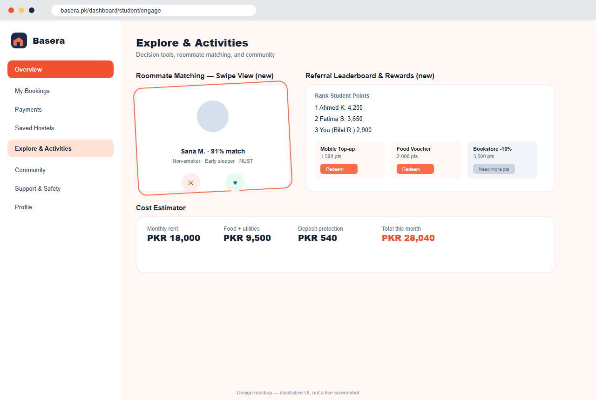
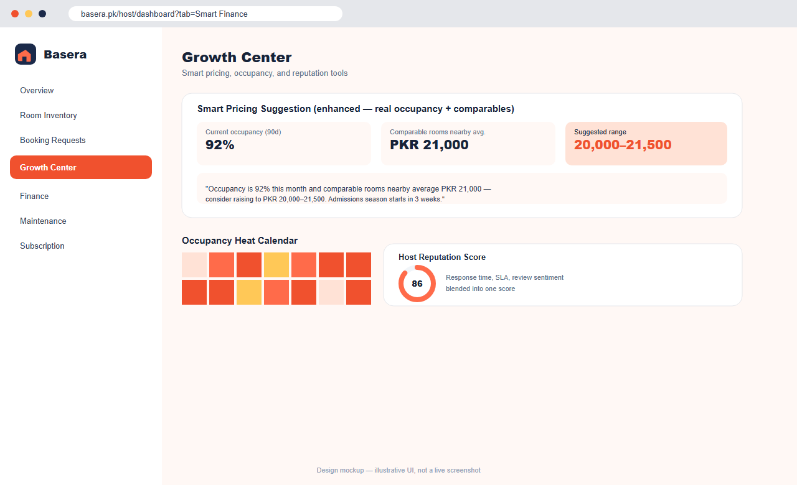

# Basera — Complete Feature & Requirements Specification

*Consolidated from all prior planning documents (V1, V2, V3, V5, V6, Modern Feature Expansion Roadmap), the rebrand audit, and the live codebase as of August 23, 2026. This is the single reference for what Basera is, who it serves, and everything it does or will do.*

---

## 1. Product Vision

Basera (Urdu for "nest, shelter, abode") is a trust-first accommodation marketplace for Pakistan. It has two connected sides:

- **Long-stay student housing** — students and young professionals search, book, and pay for verified hostels, PGs, and shared or private rooms near their university, with rent held in escrow until they've actually moved in.
- **Short-stay Hotels & Guest Houses** — the same verification and booking infrastructure extended to travellers booking a night or a weekend, launched as a deliberately separate product vertical rather than a bolt-on.

The core differentiator is **trust, made concrete**: verification badges that mean something, rent that is protected until move-in, host contact details that are gated until a real commitment is made, and — uniquely — visibility into *who you'll actually be living with* before you book. This directly answers how student housing is found informally today: word of mouth, Facebook groups, and OLX/Zameen listings with no protection if a room doesn't match its photos or a landlord takes a deposit and disappears.

**Tagline:** *"Find your Basera."*

---

## 2. Market Context

### 2.1 Market size (by city/university cluster)

| University / City Cluster | Students | Off-Campus % | Estimated Hostel Market (PKR/yr) |
|---|---|---|---|
| NUST, QAU, COMSATS — Islamabad/Rawalpindi | 120,000+ | 60% | 1.08 Billion |
| LUMS, UET, Punjab University — Lahore | 200,000+ | 55% | 1.65 Billion |
| IBA, NED, University of Karachi | 180,000+ | 50% | 1.35 Billion |
| UET, BZU — Faisalabad | 80,000+ | 65% | 0.78 Billion |
| **Total (four clusters)** | **580,000+** | **~58% avg** | **~PKR 4.86 Billion/yr** |

A later planning pass revised this upward on a national basis: **over 1.7 million outstation students** are enrolled across universities in Islamabad, Lahore, Karachi, and Peshawar alone, of whom **fewer than 30% secure on-campus housing** — the remainder rely on informal, unprotected arrangements today.

### 2.2 Personas

| Persona | Age | Primary Need | How Basera Serves Them |
|---|---|---|---|
| Outstation Student | 18–26 | Safe, affordable room near campus, fast | Verified search, escrow-protected rent, roommate visibility |
| Working Professional | 22–32 | Privacy, flexibility, no long lease commitment | Shared/private room filters, flexible booking terms |
| Hostel Owner (single or group) | 28–55 | Fill vacancies faster, reduce disputes, get paid reliably | Growth Center, smart pricing, escrow payout, Hostel Groups branding |
| Individual Landlord | 25–60 | List one property with minimal admin overhead | Simple listing flow, contact gating protects them too |
| Female Tenant | 18–26 | Safety signals specifically (verified, other-gender presence, warden oversight) | Safety-confidence map layer, gender policy filters, warden-managed blocks |
| Parent / Guardian | 40–60 | Reassurance without needing to personally verify everything | Read-only Parent Portal share link, safety summaries |

### 2.3 Competitive positioning

No existing Pakistani platform (OLX, Zameen, HamariWeb, informal Facebook groups) combines **real-time booking with an in-platform management panel and escrow protection** — they are listing boards, not marketplaces. Global reference points like Airbnb and Booking.com validate the trust-and-booking model but don't serve the student long-stay use case at all. Basera's roommate-visibility feature (below) has no direct analogue in any of these.

---

## 3. Who Uses the Platform — Roles & Access Model

*Figure 1: The seven people Basera is built for, and what each one comes to do.*

| Role | Demo Account | What They Can Do |
|---|---|---|
| **Student / Young Professional** | `student@basera.pk` | Search, book, pay rent, message hosts (contact-gated), see roommate summaries, raise disputes, use the decision-lab tools |
| **Independent Host / Landlord** | `landlord@basera.pk` | List rooms, manage tenants and bookings, use the Growth Center and smart pricing, request deposit deductions |
| **Hostel Group Owner** | `owner@basera.pk` | Everything a Host can do, plus create a `HostelGroup` brand and attach multiple hostel branches under one verified identity |
| **Warden** | `warden@basera.pk` | Manage only the specific `Block` they're assigned to (enforced server-side); mark seats booked-offline and release them |
| **Hotel / Guest House Owner** | uses the Host login, via `/host/stays` | List and manage short-stay `Property` records and nightly bookings, separate from the student-rental inventory |
| **Admin / Trust & Finance Ops** | `admin@basera.pk` | Verification queue, finance command room, dispute resolution, moderation, platform settings |
| **Parent / Guardian** | no login — share link | Read-only safety and visit summary, generated and shared by the student |

Two additional roles exist at the **database schema level** (`property_manager` and `finance` in `User.js`'s role enum) but do not yet have a dedicated, documented dashboard or clearly scoped permission set — see the Gaps section (§9) and the Development Master Plan for the recommended next step.

---

## 4. System Architecture

*Figure 2: Basera's full technical architecture — client apps, API, database, hosting, and every optional external integration.*

| Layer | Technology | Notes |
|---|---|---|
| Web frontend | React 19, Vite, Tailwind CSS, Zustand, React Router 7, Framer Motion, Leaflet | `client/` — installable as a PWA |
| Mobile app | Expo / React Native (SDK 51), React Navigation, Zustand, Axios | `app/` — source-complete, not yet built/published (Phase 2) |
| Backend API | Node.js, Express 5, MongoDB/Mongoose, JWT auth, Socket.io | `server/` — REST under `/api/v1`, 60+ route modules |
| AI | Anthropic Claude API, env-gated (`CLAUDE_API_KEY`), template fallback when absent | `server/services/aiService.js` |
| Database | MongoDB Atlas (`basera-cluster`, free M0 tier) | Dual-mode: every route falls back to realistic in-memory demo data when no `MONGO_URI` is configured |
| Hosting | Netlify (frontend), Railway (backend) | See the Development Master Plan for exact provisioned resource IDs and go-live steps |

**The single most important architectural convention in this codebase is dual-mode demo/live behaviour.** Nearly every route checks `mongoose.connection.readyState === 1` and serves realistic in-memory data otherwise. This is what lets the *entire* platform — including brand-new features — be explored and demoed convincingly with zero setup, and it is a hard requirement for any new feature going forward (see the Master Plan's working conventions).

---

## 5. Core Data Model

*Figure 3: 14 of the platform's 60+ Mongoose models — the ones that drive the core booking and trust flow. The student long-stay path (escrow + contact gating) and the short-stay Hotels/Guest-Houses path are deliberately separate models sharing the same trust layer.*

The full model set spans identity (`User`, `RoommateProfile`), property structure (`HostelGroup`, `Hostel`, `Block`, `Room`, `BedBlock`, `Property`), transactions (`Booking`, `StayBooking`, `EscrowTransaction`, `LedgerEntry`, `Discount`, `RentOffer`), trust (`Dispute`, `DepositCase`, `Review`, `SafetyIncident`, `TrustScore`, `HostelDNAScore`), community (`CommunityPost`, `RoommateRequest`, `HostelPoll`, `MarketplaceItem`, `LostFoundItem`), and platform operations (`AuditLog`, `PolicyRule`, `WebhookEvent`, `JobLog`, `PlatformSetting`).

---

## 6. Complete Feature Inventory

### 6.1 Core marketplace (foundational, complete)
Public listings and search; map-based discovery (bounding-box, polygon, and radius search; affordability, isochrone-commute, and safety-confidence overlays); hostel and room detail pages; booking flow; escrow-held payments (JazzCash/EasyPaisa/Stripe shells, ready for live credentials); student, host, and admin dashboards; contact gating until paid confirmation; chat with contact-leak filtering; discounts and coupons; referral loyalty points; PDF documents (receipts, ledgers, agreements, payout statements) with public QR verification; recurring rent reminders; dispute resolution workflow; deposit handling; review moderation; KYC/verification queue; community suite (feed, roommate requests, polls, marketplace, lost & found); neighbourhood intelligence (points of interest, commute times, rickshaw fares); and the full "V6" platform layer (finance command room, trust center, growth ops, academic calendar, group bookings, digital tenancy agreements, mess menu ratings, live room board, student trust score).

### 6.2 Booking & Escrow Workflow

*Figure 4: How a student's rent moves from payment to host payout, and what happens if a dispute is raised.*

Student pays rent + deposit + service fee (with an optional Deposit Protection add-on); funds are held in escrow while commission is calculated; after move-in plus a 48-hour no-dispute hold window, the host is paid out and a statement is issued. A dispute raised before payout blocks release until an admin resolves it and issues a resolution letter. A report of an off-platform payment attempt also blocks payout automatically and opens a high-priority review case.

### 6.3 Host Listing Workflow

*Figure 5: How a host or hostel group gets a property live on the platform.*

### 6.4 Trust, Safety & Roommate Visibility (the core differentiator)
- **Contact gating** — host phone/email/WhatsApp are hidden until a paid, confirmed booking (short-stay Hotels/Guest-Houses bookings are a deliberate exception — see §8).
- **Chat and listing filtering** — phone numbers, emails, external links, and off-platform payment instructions are masked or flagged automatically, both in chat and in listing submissions before publishing.
- **Roommate visibility** — a student's profile can optionally include an `occupantProfile` (type — student/teacher/working professional/freelancer/other, field/subject, study level, a short bio, and an opt-out toggle). Anyone browsing a shared room sees a category-level summary of who already lives there — *"Currently living here: 1 Working Professional (Schoolteacher, Mathematics) — quiet, early sleeper"* — without ever revealing a name, email, or phone number. This lets a student who specifically wants, say, a maths-teacher roommate find and choose that room, while respecting everyone's privacy.
- **Verification & moderation** — KYC/OCR review, listing quality scoring, audit logs, operational health checks, review moderation.
- **DNA score, trust score, and vacancy forecast** — legitimate, deterministic scoring formulas (not machine learning, despite the naming) that surface a hostel's overall health at a glance.

### 6.5 Hostel Groups, Blocks & Wardens

*Figure 6: A hostel chain's branded group page, listing every branch under one verified identity.*

Hostel chains/brands (e.g. "Royal Group of Hostels") are first-class: a `HostelGroup` model, `GET/POST /api/v1/hostel-groups`, a group-level branding page (`/hostel-groups/:slug`), and hostel search that matches group names too, so searching "Royal" surfaces every branch. Larger properties can be split into physical `Block`s, each with an assigned Warden — a role that can log in and see (and act on) only the blocks assigned to them, enforced server-side, not just hidden in the UI.

*Figure 7: The Warden Dashboard, including the manual seat-booked override.*

**Manual seat-booked override** lets a warden, host, or admin mark a specific bed as booked through an off-platform channel (e.g. "a family paid cash directly, verified on-site") with a reason note, using the existing bed-block mechanism extended with a `booked_offline` state — visually distinct from repair/cleaning holds, and reversible with a one-click Release.

### 6.6 Hotels & Guest Houses (the new vertical)

*Figure 8: The parallel short-stay vertical, deliberately styled to look and feel different from the monthly student listings.*

A parallel short-stay product for travellers, built as separate models (`Property`, `StayBooking`) rather than overloading the student-hostel models, since nightly pricing, date-range booking, and guest-contact expectations are genuinely different from monthly rent plus escrow. Public search/detail pages (`/stays`, `/stays/:id`), a guest's own bookings (`/dashboard/stays`), and an owner-facing manager (`/host/stays`) reuse the same verification/trust infrastructure as the student side, extending Basera from "student housing marketplace" to "verified stays marketplace" without diluting the core product.

### 6.7 Student Tools

*Figure 9: The student dashboard and decision-lab tools.*

Overview, bookings, payments/rent, reviews, disputes, documents, safety/support, emergency contact, alert acknowledgements, maintenance tickets; smart room comparison, roommate compatibility matching (including a swipeable Tinder-style UI), saved search alerts, referral loyalty points with a leaderboard and rewards marketplace, outdoor activity planning with contribution tracking; multi-stop route planner, saved/shareable routes, study session creation, packing checklist PDFs, commute/rickshaw fare cards, rent split calculator; AI room match quiz, room comparison board, cost estimator, roommate score, saved-search triggers, parent share link, visit scheduler, move-in checklist, refund preview, campus groups, wallet credits, and a student concierge (real Claude AI when configured); manual payment challans with proof upload, QR move-in pass, guardian portal share links, vendor marketplace ordering, waitlist automation, and campus ambassador applications.

### 6.8 Host Tools

*Figure 10: The Host Growth Center, including AI-informed smart pricing.*

Room inventory, booking requests, tenants, finance, ledger, maintenance, bed holds, chat, rent reminders; portfolio map with occupancy/revenue location cards and map-story publishing for neighbourhood tours; growth coach, smart pricing informed by real occupancy, comparable nearby prices, and academic-calendar seasonality (not a flat guess), occupancy heat calendar, bulk room editor, tenant CRM snapshot, maintenance SLA board, reply templates, reputation score, and an AI listing-description generator; Starter/Pro/Premium subscription management with monthly invoices and manual proof upload for hosts without gateway payments.

### 6.9 Admin, Finance & Trust Operations
Platform stats, user management, verification queue, finance, loyalty claims, global alert approvals, operations monitoring, KYC/OCR review, listing quality scoring, review moderation, dynamic platform settings, discounts, payout queue, disputes; city analytics map, city comparison metrics, heatmap review, map cache invalidation; command-room finance KPIs, ledger explorer, escrow waterfall, payout approval room, deposit liability register, host statements, revenue forecast, trust queue, incident timeline, verification visit planner, policy rules, moderation explainability, city scorecard, finance anomaly detector, dispute summary assistant, and review classifier; manual-payment review, field-verification scheduling, host subscription invoices, vendor order oversight, trust timelines, review sentiment, and campus ambassador approvals.

### 6.10 AI Features
Five `/ai/*` endpoints — concierge, listing description generator, finance anomaly detection, dispute summarizer, review classifier — all call the real Anthropic Claude API when `CLAUDE_API_KEY` is set, each with an 8-second timeout and automatic, silent fallback to the original deterministic template logic on any failure. **Important labeling distinction:** the DNA score, trust score, and vacancy-forecast features are legitimate deterministic formulas, not AI/ML — this document and all public-facing copy should be accurate about which features are genuinely AI-driven.

### 6.11 Maps & Neighbourhood Intelligence
Leaflet + OpenStreetMap tiles, OSRM route proxy with fallback, affordability layers, isochrone commute-ring summaries, safety-confidence cells, demand pulse, parent-safe map summaries, offline campus-pack metadata, and browser service-worker tile caching; nearby points of interest, a facilities score strip, commute times, rickshaw fare estimates, a hostel photo feed, and host-created map stories on room/hostel detail pages.

### 6.12 Financial Infrastructure
Double-entry ledger, commissions, deposits, reconciliation, payout approvals, host statements, student wallet credits, refund previews with transparent ETA/reason, and revenue forecasts; host profit-and-loss, cash-flow forecast, an FBR withholding-tax helper, a utility-bill splitter, and consolidated multi-property finance for hostel groups.

### 6.13 Communication & Notifications
Socket.io real-time chat with contact-leak filtering; push notifications via a service worker (VAPID) for rent, escrow, and dispute updates; transactional email for receipts and reminders. **SMS is intentionally not yet wired** — see §9.

### 6.14 Mobile App
A complete Expo/React Native project at `app/` — navigation, auth, home/search/listing-detail/booking/bookings/profile screens, all calling the same `/api/v1` backend — plus three intentionally stubbed "Coming Soon" screens (Rider Booking, Food Ordering, Job Seeker), so the app visibly signals room to grow without being half-built. Not yet installed, built, or published — see the Development Master Plan, Phase 2.

---

## 7. Monetization & Revenue Model

### 7.1 Live, configured revenue streams (current implementation)

| Stream | Current Config Default | Notes |
|---|---|---|
| Commission on bookings | `COMMISSION_RATE_DEFAULT = 0.07` (7% flat) | Applied at escrow release |
| Student service fee | `STUDENT_SERVICE_FEE_PKR = 400` | Flat per booking |
| Late payment fee | `LATE_FEE_PKR = 500` | Recurring rent |
| Deposit protection add-on | `DEPOSIT_PROTECTION_FEE_RATE` + cap | Optional, pilot/platform-backed, not yet underwritten |
| Off-platform report credit | `OFF_PLATFORM_REPORT_CREDIT_PKR` | Incentivizes reporting off-platform payment attempts |
| Host management fee (subscription) | `BASERA_MANAGEMENT_FEE_PKR = 1000` | Starter/Pro/Premium tiers |

### 7.2 Original planning-document detail worth preserving

The earliest planning documents specified a more granular commission structure and several monetization mechanics that have **not been confirmed as fully implemented** with these exact parameters — they are documented here as the original design intent, to be reconciled deliberately (not silently) as monetization matures:

| Booking Value | Commission | Host Receives |
|---|---|---|
| Up to PKR 10,000 | 5% | 95% |
| PKR 10,001–25,000 | 7% | 93% |
| PKR 25,001–60,000 | 8% | 92% |
| Above PKR 60,000 | 6% | 94% |
| Semester/Annual | Flat 6% | 94% |
| Trial Stay (3–7 days) | 10% | 90% |
| **SuperHost tier** (verified + 20 reviews + 4.5★ avg + 90% response rate + 0 upheld disputes in 6 months) | 5% (reduced) | 95% |

Additional fee ideas from the original plans, not yet confirmed as priced, live features: **Featured/Spotlight listing** (PKR 2,000–8,000/month), **fast-track verification badge** (PKR 1,000–1,500 one-time), **instalment processing fee** (PKR 200–500 per instalment), **frivolous dispute fee** (PKR 500, charged to the disputing party if a claim is dismissed as baseless).

**SaaS tier pricing has drifted across three sources and should be reconciled explicitly:** an early plan proposed Starter (free) / Growth (PKR 3,999/mo) / Pro (PKR 9,999/mo); a later plan proposed four tiers, Starter/Essential/Professional/Enterprise; the live platform today implements **Starter/Pro/Premium** with a single admin-configurable management fee and no publicly documented per-tier PKR pricing. Recommendation: pick one naming and pricing scheme and state it plainly in both the app and this document — see the Development Master Plan's backlog.

### 7.3 Discount engine
Automatic, coupon, and host-funded discount APIs exist today. The original design specified eight distinct discount *types* — Seasonal, City, Room Type, Referral, Host-Funded, **Loyalty (auto 3% from the 2nd month)**, **Early Bird (auto 5% if booked 30+ days ahead)**, and **Last-Minute Deal (auto 8% for rooms vacant 7+ days)** — of which the three auto-triggered types in bold are not confirmed as implemented rules today and are worth a focused build pass.

---

## 8. Trust & Safety Rules (Business Logic Reference)

- **Escrow hold window:** `ESCROW_HOLD_HOURS = 48` after move-in with no dispute before payout releases.
- **Contact gating is deliberate, not an oversight.** Any feature connecting two users (host/student, property owner/guest, roommates) defaults to withholding direct contact details until there's a real commitment. The one documented exception is short-stay Hotels/Guest-Houses bookings, where guest contact is shared at booking time — a deliberate choice given the shorter, lower-risk nature of a 1–3 night stay.
- **Off-platform payment protection:** a student's report of an off-platform payment attempt blocks escrow release and opens a high-priority case automatically.
- **Original design also specified** (not yet confirmed as implemented with these exact rules): an **escalation ladder** for repeated off-platform behaviour (2+ months triggers admin contact, then listing pause); an **automatic blacklist** after 3+ verified complaints, pending investigation; a **photo-guarantee/relocation policy** (a free relocation booking if listing photos don't match the physical condition, on a successful dispute); and an **automatic price-anomaly flag** for listings priced above 2× or below 0.3× the market median for their area, held for admin review pending approval.

---

## 9. Known Gaps & Deliberate Simplifications vs. Original Plans

These are honest, documented differences between the earliest specifications and what's live today — not silent omissions. Each should be treated as a real backlog candidate (tracked in the Development Master Plan), not a defect.

| Area | Original Spec | Current State |
|---|---|---|
| SMS (OTP, reminders) | Twilio SMS wired for OTP and every rent-reminder stage | Not wired — email and push are the only live notification channels; SMS credentials are reserved for future use |
| Phone verification / OTP | `/auth/verify-otp`, `isPhoneVerified` field | No OTP flow — registration is email + password only |
| Auth tokens | `/auth/refresh-token` with rotation | Single JWT, 7-day expiry, no refresh/rotation |
| Password reset | `/auth/reset-password` with email template E-20 | Not confirmed as wired end-to-end |
| SuperHost commission tier | 5% reduced commission for top-tier hosts | Not implemented as a distinct, automated tier |
| SEO content hub | A blog of SEO-friendly articles ("Best Hostels near NUST 2026"), Google Business Profile + Search Console registration | Per-page meta tags and sitemap exist; no content hub or GBP/GSC process yet |
| Product analytics | GA4 / PostHog event tracking | Not implemented; Sentry error tracking is configured (optional) |
| Bulk tenant messaging | "Notify all tenants" broadcast from host dashboard | Not clearly present in the current host feature set |
| `property_manager` / `finance` roles | Distinct, scoped dashboards ("subset of Host, no financial access" / dedicated finance-room access) | Present in the `User` schema's role enum only — no dedicated UI or documented server-side scoping yet |
| Search engine visibility | — | This is a client-rendered single-page app; without server-side rendering or prerendering, search engines that don't fully execute JavaScript see a near-empty page. High-impact, moderate-effort fix flagged for Phase 3. |

---

## 10. Non-Functional Requirements

- **Explorability:** the entire platform must remain fully demoable with zero setup — no database, no API keys — via the dual-mode demo/live pattern described in §4.
- **Graceful AI degradation:** any AI-labeled feature must be env-key-gated, timeout-bounded, and fall back silently to deterministic logic on failure or absence of a key; UI copy must never claim AI/ML behaviour that is actually a fixed formula.
- **Bilingual support:** English/Urdu toggle with RTL awareness (`useLocaleStore`), currently covering the parent portal fully and partially elsewhere — full-site coverage is a near-term roadmap item.
- **Security baseline:** JWT secrets must never fall back to a hardcoded default in production (the server now logs a loud warning if `JWT_SECRET` is missing, though it does not yet refuse to boot); stale sessions for deleted/deactivated users must be rejected once a real database is connected.
- **Accessibility & responsiveness:** the product must work credibly on the low-to-mid-range Android devices most common among the Pakistani student demographic, and as an installable PWA where a native app isn't yet available.
- **Data protection for minors/roommate context:** occupant/roommate visibility must never surface a name, email, or phone number — category-level information only, with a student-controlled opt-out.

---

## 11. Incoming / Future Features

See the **Development Master Plan & Phased Roadmap** for the full phase-by-phase backlog. In brief, the next validated directions beyond the current build are: search-engine visibility (SSR/prerendering), a WhatsApp Business API booking assistant, full bilingual site coverage, native mobile app publication, genuine reverse-image/perceptual-hash fraud detection, real OCR-based ID verification, swipeable roommate matching taken further, real demand-based dynamic pricing trained on transaction history, a licensed deposit-protection insurance partner, a gamified referral rewards marketplace, video/voice testimonials, and — staged deliberately last, each requiring its own focused planning pass — three adjacent new verticals: **rider booking**, **food ordering** (starting from the existing mess-menu system), and a **job/internship board** for the same student audience.
