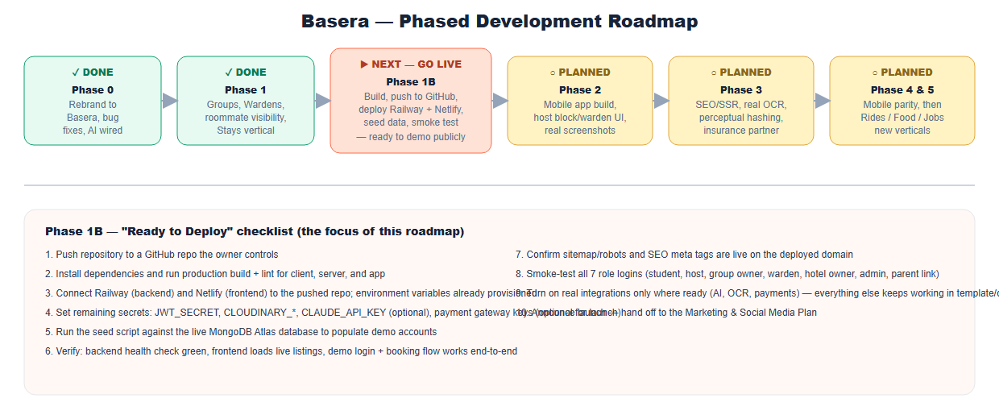
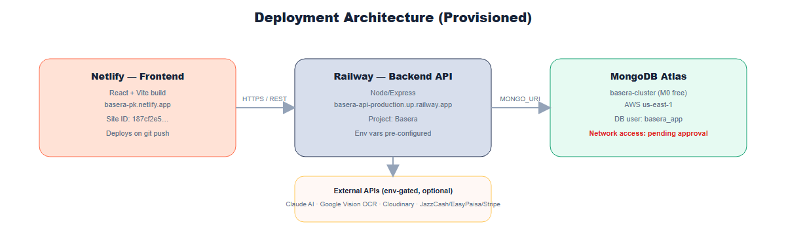

# Basera — Development Master Plan & Phased Roadmap

*How Basera was built, what's already done, and exactly what's left to do — with Phase 1 scoped specifically to reach a live, deployable state on Railway (backend) and Netlify (frontend).*

---

## 1. Purpose of This Document

This is the single reference for planning and sequencing Basera's ongoing development. It merges the original phased roadmap, the deployment runbook, and every follow-up item surfaced during the rebrand audit and the legacy-document review into one prioritized plan. Pair this with the **Feature & Requirements Specification** (which describes *what* Basera does) — this document is about *when* and *how* it gets built and shipped.

---

## 2. Architecture Recap

| Layer | Technology | Hosting |
|---|---|---|
| Web frontend | React 19, Vite, Tailwind, Zustand | Netlify |
| Backend API | Node.js, Express 5, MongoDB/Mongoose, Socket.io | Railway |
| Database | MongoDB Atlas (free M0 tier) | MongoDB Atlas |
| Mobile app | Expo / React Native | Not yet published (Phase 2) |

The platform's defining convention is **dual-mode demo/live behaviour** — every route falls back to realistic in-memory data when no database is connected, so the whole app is explorable before a single environment variable is set. Preserve this pattern for every future feature.

---

## 3. Phased Roadmap Overview


*Figure 1: Where Basera stands today and what comes next. Phase 1B — reaching a live public deployment — is the immediate priority.*

| Phase | Status | Scope |
|---|---|---|
| Phase 0 — Rebrand & Foundation | ✅ Complete | Rebrand to Basera, bug fixes, first round of advanced features, cloud infrastructure provisioning |
| Phase 1 — SaaS Expansion | ✅ Complete | Hostel Groups, Blocks/Wardens, manual seat override, roommate visibility, Hotels & Guest Houses vertical, mobile app source tree |
| **Phase 1B — Go Live** | ▶ **Next — this is the deployment milestone** | Push to GitHub, build, deploy to Railway + Netlify, seed data, verify end-to-end |
| Phase 2 — Real Installed Build | ○ Planned | Mobile app build & store submission prep, host-facing block/warden UI, real screenshots |
| Phase 3 — Trust & Intelligence Hardening | ○ Planned | SEO/SSR, real OCR, perceptual-hash fraud detection, insurance partner, analytics |
| Phase 4 — Mobile App Feature Parity | ○ Planned | Bring the mobile app to parity with the web student experience, then extend to hosts |
| Phase 5 — New Verticals | ○ Planned | Rider booking, food ordering, job/internship board |

---

## 4. Phase 1B — "Ready to Deploy" Runbook (Do This Next)

This phase has one goal: **get the current, fully-built codebase live on the internet**, on the infrastructure already provisioned, so it can be demoed publicly and handed to real users.

### 4.1 What's already provisioned (no action needed)

**MongoDB Atlas**
- Organization `Own`, Project `Basera`, Cluster `basera-cluster` — free M0 tier, AWS `us-east-1`.
- Database user `basera_app` (readWrite scoped to the `basera` database only).
- Network access is open to `0.0.0.0/0` (still requires username/password) — tighten later to Railway's specific egress ranges if desired, via Atlas → Network Access.

**Railway (backend)**
- Project `Basera`, service `basera-api`, public domain already generated: `https://basera-api-production.up.railway.app`.
- Non-secret environment variables already set (client URL, escrow/commission/fee defaults, rate limits, map cache TTL, etc.) — see Appendix A for the full list.
- `railway.json` at the repo root already configures `startCommand: npm run start --prefix server` for this monorepo layout.

**Netlify (frontend)**
- Site `basera-pk`, URL once deployed: `https://basera-pk.netlify.app`.
- `netlify.toml` at the repo root already configures base=`client`, build=`npm install && npm run build`, publish=`client/dist`, SPA redirect, and security headers.
- Environment variables already set: `VITE_API_URL`, `VITE_SITE_URL`, `VITE_ALLOW_DEMO_FALLBACK=false`, `VITE_SUPPORT_WHATSAPP`.

### 4.2 Deployment architecture


*Figure 2: How the three provisioned services connect once deployed.*

### 4.3 Step-by-step checklist

1. **Push the code to a GitHub repository you control.** The repo's current Git remote points to a repository that is not yours — do not push there. From your own machine:
   ```bash
   cd path\to\Hostel_Hub
   git remote set-url origin https://github.com/<your-username>/<your-new-repo>.git
   git add -A
   git commit -m "Basera: rebrand, features, and Phase 1 SaaS expansion"
   git push -u origin main
   ```
2. **Install and build locally first**, to catch anything a build step would catch:
   ```bash
   npm install --prefix client && npm run build --prefix client && npm run lint --prefix client
   npm install --prefix server
   ```
3. **Connect Railway to the pushed repo.** Railway dashboard → `Basera` project → `basera-api` service → Settings → Source → connect your GitHub repo. `railway.json` already handles the monorepo root/start command — no manual path configuration should be needed.
4. **Connect Netlify to the pushed repo.** Netlify dashboard → `basera-pk` → Site configuration → Build & deploy → Link repository → connect the same repo. `netlify.toml` already handles the build path.
5. **Add the remaining secrets directly in each dashboard** (never share these in chat with an AI assistant or paste them into a document):
   - Railway → `basera-api` → Variables: `JWT_SECRET` (long random string, never reused from the database password), `CLOUDINARY_CLOUD_NAME` / `CLOUDINARY_API_KEY` / `CLOUDINARY_API_SECRET`, `CLAUDE_API_KEY` (optional — activates real AI features), `OCR_API_KEY` + `OCR_PROVIDER=google-vision` (optional), payment gateway keys (optional for a soft launch — the platform runs fully in demo-payment mode without them), `VAPID_PUBLIC_KEY` / `VAPID_PRIVATE_KEY`, `CRON_SECRET`.
   - Netlify → `basera-pk` → Environment variables: confirm `VITE_ENABLE_CLIENT_DEMO_LOGIN=false` is saved (a prior connector hiccup stopped this from saving automatically).
6. **Trigger the first deploy** on both services (push-to-deploy takes over automatically once connected).
7. **Seed demo data** against the live database once the backend is reachable:
   ```bash
   npm run seed --prefix server
   ```
   This populates the demo accounts (`student@basera.pk`, `landlord@basera.pk`, `owner@basera.pk`, `admin@basera.pk`, `warden@basera.pk`, all password `password123`) into the real database.
8. **Verify:**
   - Backend health check: `https://basera-api-production.up.railway.app/api/v1/health`
   - Frontend loads real listings (not just the offline fallback) at `https://basera-pk.netlify.app`
   - A demo login and full booking flow works end to end
   - The AI concierge responds (once `CLAUDE_API_KEY` is set)
9. **Smoke-test all seven role logins** (student, independent host, hostel group owner, warden, hotel/guest-house owner via `/host/stays`, admin, and the parent share-link flow) using the **Demo Guide for All Roles** document.
10. **Hand off to marketing** — once verified live, proceed to the Marketing & Social Media Plan for launch content.

### 4.4 Rollback / safety notes
- Rotate the Atlas database password if it is ever pasted into an insecure channel (Atlas → Database Access).
- Do not skip setting a strong, unique `JWT_SECRET` — the codebase currently warns loudly if it's missing in production but does not refuse to boot, so this is a manual must-do, not an automatic safeguard.
- Payment gateway keys, `CLAUDE_API_KEY`, and `OCR_API_KEY` are all optional at launch — every feature they power has a documented, working fallback, so a soft launch without them is a legitimate choice, not a broken deployment.

---

## 5. Working Conventions for Whoever Builds the Next Phase

- **Always support both demo and live mode.** Check `mongoose.connection.readyState === 1`; fall back to an in-memory array otherwise. This is not optional polish — it's how the entire platform stays explorable without a database.
- **Contact gating is a deliberate trust mechanism, not an oversight.** Any new feature that connects two users should default to withholding direct contact details until there's a real commitment, unless there's a specific, documented reason not to (as with short-stay guest bookings).
- **New "AI" features must be genuinely gated and genuinely optional.** Follow the `aiService.js` pattern: env-key-gated, timeout-bounded, silent fallback to deterministic logic on any failure. Never claim AI/ML behaviour that's actually a fixed heuristic.
- **Every new page needs a route in `client/src/App.jsx` and, where relevant, a nav entry.** Several features have historically been "backend-complete, not yet linked from the main dashboard nav" — an easy thing to leave half-done.
- **Reconcile, don't silently pick, when historical specs disagree** (SaaS tier names/pricing, commission tiers) — see the Feature Specification's Monetization section for the specific conflicts to resolve.

---

## 6. Phase-by-Phase Backlog

### Phase 2 — Real Installed Build
1. `npx expo install --fix` inside `app/` to reconcile dependency versions against Expo SDK 51.
2. Export real PNG icon/splash assets from `client/public/logo.svg` for the mobile app.
3. Take real screenshots of the running app, replacing the illustrative diagrams in this document set.
4. Add a host-facing UI for creating blocks and assigning wardens (`POST/PUT /api/v1/blocks` already supports this server-side; only the warden-side dashboard was built in Phase 1).
5. Add a "My Properties" link to the host dashboard for the Stays manager (`/host/stays` is currently only reachable by direct URL).
6. Prepare Apple App Store / Google Play Store submission materials.

### Phase 3 — Trust & Intelligence Hardening
1. Server-side rendering or static prerendering for public marketing/listing pages, so search engines index Basera properly (highest-impact item on this list).
2. Move duplicate-photo detection from the coarse fallback hash to true perceptual hashing (`npm install sharp`), and add address-matching as the second half of duplicate-listing detection.
3. Onboard a real OCR provider (`OCR_API_KEY`, Google Vision) to replace the current metadata-only document check.
4. Extend real Claude usage to any newly added AI-adjacent surfaces.
5. If pursued, onboard a real deposit-insurance underwriting partner to replace the current pilot/fee-only version.
6. Add product analytics (GA4 or PostHog) — currently no event tracking is implemented; Sentry error tracking exists but is optional/unconfigured.
7. Build the SEO content hub (city/university guide articles) and register Google Business Profile + Search Console.
8. Wire SMS (Twilio) for OTP and rent-reminder escalation, and add the `/auth/refresh-token` and `/auth/reset-password` flows specified in the original plans but not yet built.
9. Implement the SuperHost reduced-commission tier and the auto-triggered Loyalty/Early-Bird/Last-Minute discount types.
10. Give `property_manager` and `finance` roles (already present in the `User` schema) real, scoped dashboards, or remove them from the schema if they're not going to be pursued.
11. Consider self-hosting OSRM/Overpass on Railway if map traffic grows beyond what the public instances comfortably serve.

### Phase 4 — Mobile App Feature Parity
Bring the mobile app to parity with the web app's student experience (saved searches, chat, documents/receipts, push notifications via the existing VAPID setup), then extend it to hosts with a lightweight app for booking requests and messaging on the go.

### Phase 5 — New Verticals (the "Coming Soon" features)
Each of these is close to its own product, not a Basera feature extension, and should get its own focused planning pass (data model, moderation approach, monetization) before implementation begins:
- **Rider booking** — likely a thin integration with an existing ride-hailing API/partner rather than building dispatch logic from scratch; scope as "get a ride to campus."
- **Food ordering** — start with hostel mess-menu partners (the mess-menu rating system already exists) before expanding to nearby restaurants.
- **Job seeker** — part-time/internship listings targeted at the same student base, plausibly monetizable via employer-paid listings, reusing the existing verification/trust infrastructure to vet employers.

---

## 7. Risk Register / Known Follow-Ups

| Risk | Recommended Action |
|---|---|
| `JWT_SECRET` unset in production | Set before go-live; server warns but does not refuse to boot |
| Atlas DB password exposure | Rotate immediately via Atlas → Database Access if ever shared insecurely |
| SPA has no server-side rendering | Prioritize in Phase 3 — currently limits organic search visibility |
| SaaS tier naming/pricing inconsistent across historical docs | Resolve explicitly (see Feature Spec §7.2) rather than leaving ambiguous |
| Deposit Protection is not underwritten | Keep UI copy explicit that this is a pilot/platform-backed add-on, not licensed insurance, until a partner is onboarded |
| Legacy `.docx` planning documents | Superseded by this document set; archived out of the active repository (see the top-level README) |

---

## Appendix A — Environment Variables Reference (Non-Secret Defaults)

| Variable | Purpose |
|---|---|
| `ESCROW_HOLD_HOURS` | Hours after move-in before payout releases (default 48) |
| `COMMISSION_RATE_DEFAULT` | Platform commission on bookings (default 0.07) |
| `STUDENT_SERVICE_FEE_PKR` | Flat per-booking service fee |
| `LATE_FEE_PKR` | Recurring rent late fee |
| `DEPOSIT_PROTECTION_FEE_RATE` / `_CAP_PKR` | Optional deposit-protection add-on pricing |
| `OFF_PLATFORM_REPORT_CREDIT_PKR` | Incentive credit for reporting off-platform payment attempts |
| `BASERA_MANAGEMENT_FEE_PKR` | Host subscription management fee |
| `RICKSHAW_FARE_PER_KM` | Used in commute/fare estimate cards |
| `MAP_CACHE_TTL_HOURS`, `OSRM_BASE_URL`, `OVERPASS_BASE_URL` | Map intelligence configuration |
| `AI_PROVIDER`, `CLAUDE_API_KEY` | AI feature gating |
| `OCR_PROVIDER`, `OCR_API_KEY` | Real ID-document OCR gating |
| `ALLOW_DEMO_MODE`, `VITE_ALLOW_DEMO_FALLBACK` | Dual-mode demo/live toggles |

Secrets (never store in a document — set directly in the Railway/Netlify dashboards): `JWT_SECRET`, `CLOUDINARY_*`, payment gateway keys (`JAZZCASH_*`, `EASYPAISA_*`, `STRIPE_*`), `VAPID_PUBLIC_KEY`/`VAPID_PRIVATE_KEY`, `CRON_SECRET`.
