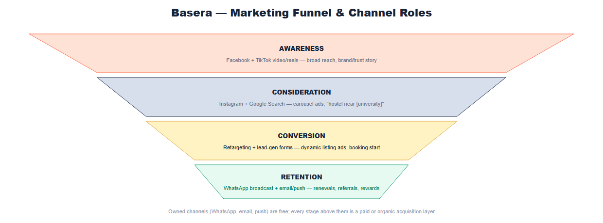

# Basera — Marketing & Social Media Plan

*The complete go-to-market content and advertising plan: organic social strategy, a ready-to-use daily content prompt system, and a paid-advertising plan layered on top — designed to launch alongside Phase 1B's go-live.*

---

## 1. Brand Recap

- **Name:** Basera (Urdu for "nest, shelter, abode") — **Tagline:** *"Find your Basera."*
- **Colors — "Coral Modern":** Coral `#FF6B4A` (primary/CTAs), Deep Navy `#1B2A4A` (headers/dark UI), Sunflower Yellow `#FFC857` (badges/highlights), Warm off-white `#FFF8F5` (background).
- **Voice:** warm, trustworthy, a little witty, never corporate-sounding — like a helpful senior student, not a real estate agency.

---

## 2. Platform Strategy

Facebook remains Pakistan's largest platform by user count (~101.6 million), with YouTube close behind (~96.6 million) and TikTok fastest-growing among adults 18+ (~90.3 million, and the platform young people reach for first). Instagram is smaller in absolute terms (~24 million) but skews heavily toward the 18–24 bracket — Basera's core student audience — and is where "verified, aesthetic, trustworthy" brand visuals land best. WhatsApp is near-universal and already wired into the product as a support channel, making it a natural funnel extension rather than a separate platform to manage from scratch.

*Sources: Samaa TV — "Social media users in Pakistan cross 51.6m; Facebook most popular"; NapoleonCat — "Social Media Users in Pakistan 2026"; Datambar — "Pakistan Social Media Usage Trends 2026"; StateGlobe — "Top 10 Social Media Platforms in Pakistan 2026".*

| Platform | Role | Content Style |
|---|---|---|
| Instagram | Primary brand channel | Reels, carousels, Stories — verified listings, student life, city guides |
| TikTok | Growth/reach engine | Short, native-feeling video — room tours, "day in the life," myths vs. facts |
| Facebook | Broadest reach, older/parent audience, city groups | Listings, safety/trust messaging, community group engagement |
| WhatsApp | Direct response & community | Broadcast lists, city/university channels, the in-app WhatsApp button |
| YouTube | Long-form trust content | Full hostel tours, "how escrow protects your rent" explainers, host interviews |
| LinkedIn | Host/property-partner acquisition, B2B credibility | Host success stories, platform milestones, hiring |

---

## 3. Content Pillars

1. **Verified & Safe** — verification badges, escrow protection, safety features, real reviews. Basera's actual differentiator versus informal Facebook-group room hunting.
2. **Real Listings** — featured rooms/hostels, price comparisons, "new this week," city-specific inventory.
3. **Student Life** — relatable content unrelated to booking (exam season, mess food, budgeting, roommate humor) — builds reach without selling.
4. **City & Campus Guides** — practical, SEO-friendly content ("Best areas to live near NUST") that doubles as shareable, evergreen content.
5. **Host & Community Stories** — testimonials from hosts and students, building two-sided marketplace trust.

---

## 4. Weekly Posting Cadence

| Day | Theme | Pillar | Primary Platform |
|---|---|---|---|
| Monday | Listing Spotlight | Real Listings | Instagram + Facebook |
| Tuesday | Trust & Safety Tip | Verified & Safe | Instagram + LinkedIn |
| Wednesday | City/Campus Guide | City & Campus Guides | TikTok + YouTube Shorts |
| Thursday | Student Life / Relatable | Student Life | TikTok + Instagram Reels |
| Friday | Host or Student Story | Host & Community Stories | Instagram + Facebook |
| Saturday | Price/Deal Highlight | Real Listings | WhatsApp broadcast + Instagram Stories |
| Sunday | Community Q&A / Myth-busting | Verified & Safe | Instagram + Facebook |

Post at least once per day per active platform; Instagram and TikTok can support a second Stories/short-video post on high-activity days (semester start, exam season, Eid, back-to-campus in September/February).

### Sample 4-week content calendar

| Week | Mon | Tue | Wed | Thu | Fri | Sat | Sun |
|---|---|---|---|---|---|---|---|
| 1 | Featured girls' hostel, Lahore | "What 'verified' actually means" | Best areas near LUMS | Mess menu meme/poll | Student testimonial video | Weekend price drop roundup | Q&A: "Ask us about deposits" |
| 2 | Featured PG, Islamabad | Escrow explainer carousel | Cost of living: Karachi vs. Islamabad | "Roommate red flags" Reel | Host story: why they joined | Flash discount code post | Myth: "hostels near campus are always expensive" |
| 3 | Featured shared room, Karachi | Safety feature: contact gating explained | Best areas near NUST | Exam season survival tips | Student story: first move-in | New listings this week roundup | Poll: "What matters most in a hostel?" |
| 4 | Featured studio, Faisalabad | How disputes get resolved | Best areas near FAST | Budgeting-on-a-student-budget carousel | Referral spotlight | Weekend price drop roundup | Q&A: booking process walkthrough |

Rotate cities and universities each month so coverage stays fresh and locally relevant.

---

## 5. Hashtags, Timing & KPIs

**Hashtag sets (rotate, don't repeat every post):** `#BaseraPK #StudentHousingPakistan #HostelLife #PGAccommodation #LahoreStudents #IslamabadStudents #KarachiStudents #NUSTHostel #LUMSHostel #FASTHostel #VerifiedHostel #StudentLifePakistan`

**Best posting windows:** 7–9pm weekdays (after classes), 12–2pm / 8–10pm weekends. Avoid posting during exam-week evenings unless the content is exam-support themed.

**KPIs to track monthly:** follower growth rate, saves/shares per post (a stronger buying-intent signal than likes for a housing decision), click-throughs from bio/story links, WhatsApp broadcast opt-ins, and — most importantly — **attributed signups/bookings from social traffic** (UTM-tag every link).

---

## 6. Daily Claude Prompt System

Use one prompt per day, filling in the bracketed details. Paste the **Master Prompt** into Claude each morning; it already encodes Basera's brand voice, platform mix, and today's theme from the calendar above.

### Master Daily Prompt (use this one, every day)

```
You are writing social media content for Basera (basera.pk), a verified
student hostel and room marketplace in Pakistan. Brand voice: warm, trustworthy,
a little witty, never corporate-sounding — like a helpful senior student, not
a real estate agency. Primary colors are coral (#FF6B4A) and navy (#1B2A4A).

Today's theme: [INSERT TODAY'S THEME FROM THE CONTENT CALENDAR, e.g.
"Listing Spotlight" or "Trust & Safety Tip"]
Today's specific topic/listing: [INSERT DETAILS, e.g. "3-bed girls' hostel
near Punjab University, Lahore, PKR 18,000/month, verified, WiFi + laundry
included" or "explain how escrow protects a student's rent payment"]
Target platform(s): [INSERT, e.g. "Instagram Reel + Facebook post"]

Write:
1. A short hook line (under 12 words) to open a video or carousel.
2. Full caption copy (Instagram/Facebook length, ~80-150 words), written in
   a mix of English with light, natural Urdu/Roman-Urdu phrasing where it
   would sound authentic to a Pakistani student audience (don't overdo it).
3. A one-line call to action pointing to the Basera app/site.
4. 8-10 relevant hashtags, mixing broad and city/university-specific tags.
5. If this is a video-first platform (TikTok/Reels), also write a 3-5 shot
   list describing what to film.

Keep it factual — don't invent statistics, prices, or guarantees Basera
doesn't actually offer. If unsure about a specific claim, phrase it generally
instead of making up a number.
```

### Day-specific variants (optional, for tighter platform copy)

**Monday — Listing Spotlight:**
```
Write an Instagram carousel (5 slides) spotlighting this Basera listing:
[paste listing details]. Slide 1 = hook + price, slides 2-4 = key selling
points (location, amenities, verification status), slide 5 = CTA to view/book.
Keep captions per slide under 15 words. Match Basera's warm, student-to-student
voice.
```

**Wednesday — City/Campus Guide:**
```
Write a TikTok/Reels script (30-45 seconds) titled "Best areas to live near
[university], [city]" for Basera. Structure: hook (3 sec), 3 quick area
recommendations with one line each on why, close with "see verified options
on Basera." Keep it fast-paced and genuinely useful, not just promotional.
```

**Thursday — Student Life / Relatable:**
```
Write a relatable, funny short-form video concept (TikTok/Reels) about
[topic, e.g. "roommate habits," "mess food vs. home food," "exam week
survival"] that a Pakistani university student would actually laugh at and
share. Keep any Basera branding light — one soft mention or on-screen logo,
not a hard sell. Include the hook line and a 3-4 beat script.
```

**Friday — Host/Student Story:**
```
Turn this real quote/story into a short testimonial post for Instagram and
Facebook: [paste the quote or story details]. Write a warm intro sentence,
the testimonial itself (lightly cleaned up but keep their authentic voice),
and a closing line connecting it back to Basera's verified/trust promise.
```

**Sunday — Community Q&A:**
```
Generate 5 common questions Pakistani students ask when looking for hostel
accommodation, with clear, honest, non-salesy answers reflecting how Basera
actually works (verification, escrow-protected payments, contact gating
before booking). Format as a Q&A carousel or Stories Q&A sticker set.
```

> Treat Claude's output as a strong first draft, not a final, unsupervised post — especially for anything stating a specific price, policy, or guarantee. Update the content calendar monthly to reflect real inventory, active promotions, and the academic calendar rather than following the generic rotation indefinitely.

---

## 7. Paid Advertising Plan

### 7.1 Cost benchmarks (Pakistan, 2026)

Meta (Facebook/Instagram) remains the most cost-efficient paid channel in Pakistan: CPM typically runs **$0.80–$1.50**, among the cheapest in Asia, with Facebook traffic-campaign CPC around **PKR 140–250** (lead-generation campaigns run higher, roughly **PKR 281–845 per lead**) — actual cost depends heavily on industry and targeting precision. Instagram CPCs and CPMs run 20–40% above Facebook's in the same market, arguing for using Instagram mainly for high-intent retargeting and Facebook for broad-reach prospecting. Costs rise in Q4 (October–December) and are cheapest in Q1 (January–March) — worth timing a launch push around Q1 or the admissions season rather than year-end.

*Sources: NextSol — "Facebook Ads in Pakistan: How Much Do They Cost"; Adamigo — "Meta Ads CPM & CPC Benchmarks by Country 2026"; Unboxed — "Facebook, Instagram & TikTok Ads Cost in Pakistan 2026".*

### 7.2 Funnel & channel roles


*Figure 1: How a prospective student moves from first seeing Basera to becoming a retained, referring user.*

| Stage | Goal | Primary Channel | Ad Format |
|---|---|---|---|
| Awareness | Get "verified hostel booking" into consideration | Facebook, TikTok | Video/Reels, broad interest + lookalike targeting |
| Consideration | Drive traffic to real listings | Instagram, Google Search | Carousel/collection ads, Search ads on "hostel near [university]" |
| Conversion | Get the booking/signup started | Instagram/Facebook retargeting | Dynamic listing ads pulling live inventory, lead-gen forms |
| Retention | Bring students back for renewals, referrals, rewards | WhatsApp broadcast, email/push | Owned channels, not paid |

### 7.3 Campaign structure

**Campaign 1 — Brand/Trust Awareness.** Video views + reach. Creative: 15–30s videos on escrow protection, verification badges, and roommate visibility ("Know who you're rooming with before you book"). Audience: broad, 18–26, Pakistan, interest in "university"/"hostel"/"PG accommodation," layered with a lookalike of site visitors once pixel data exists.

**Campaign 2 — City/University Conversion.** Traffic/conversions, one ad set per major city (Islamabad, Lahore, Karachi, Rawalpindi) with dynamic creative pulling real listing photos/prices. Audience: 18–24, geo-targeted within ~15km of each major university, layered with "recently moved" and admissions-season custom audiences (July–September and January–February intake windows).

**Campaign 3 — Hostel Groups & Host Acquisition (B2B).** Lead generation targeting hostel/PG owners, especially multi-property owners who'd benefit from the Hostel Groups feature ("List your whole chain under one verified brand"). Channel: LinkedIn + Facebook. This is the growth lever for *supply*, not demand — underinvested in most hostel-marketplace marketing plans.

**Campaign 4 — Hotels & Guest Houses (new vertical launch).** Awareness + conversion for travellers, entirely separate creative from the student campaigns (family trip to Murree/Naran, not university proximity). Audience: 25–45, interest in "travel Pakistan," "Murree," "Naran Kaghan," seasonal push before summer/winter tourist seasons. Google Search ads on "guest house Murree booking" queries likely outperform social here, since travel booking is higher-intent search behaviour.

**Campaign 5 — Retargeting.** Conversions, audience = site visitors who viewed a listing but didn't book (7/14/30-day windows), creative = the specific listing they viewed (dynamic ads) plus a light incentive (referral points, a limited-time waived service fee).

### 7.4 Suggested monthly budget allocation

| Campaign | % of Budget | Rationale |
|---|---|---|
| Brand/Trust Awareness | 20% | Builds the audience pools every other campaign retargets |
| City/University Conversion | 40% | Core demand-generation, highest volume |
| Hostel Groups & Host Acquisition | 15% | Supply-side growth, smaller audience, higher value per lead |
| Hotels & Guest Houses launch | 15% | New vertical, needs its own proof period before scaling |
| Retargeting | 10% | Small audience, disproportionately high conversion rate |

Start with the smallest budget that produces statistically meaningful data per campaign (Meta generally wants ~50 conversions per ad set per week to exit learning phase) rather than spreading a small budget too thin across all five at once — in month one, prioritize City/University Conversion and Retargeting, then layer in the others as budget grows.

### 7.5 Creative angles by feature (organic and paid)

- **Escrow protection:** *"Your rent is protected until you move in — not before."* Directly answers the #1 fear (paying and the room not existing/matching).
- **Roommate visibility:** *"See who you'll be living with — before you book."* Screenshot-style ad showing the occupant summary. A genuinely novel differentiator worth leading with.
- **Hostel Groups:** B2B — *"One verified brand, every branch."* B2C — search-result creative showing a recognizable group badge, using the same trust signal chain retailers use.
- **Hotels & Guest Houses:** Lifestyle-first creative (a family or friend group at a scenic guest house), not feature-first — this audience buys on the destination, not platform mechanics.
- **AI Concierge:** *"Ask Basera anything about your move — get a real answer in seconds."* Useful for retargeting users who bounced without booking.

### 7.6 Measurement

Track **cost-per-booking** (not just cost-per-click/lead) as the north-star paid metric — install the Meta Pixel and Google Ads conversion tracking on the booking-confirmation step, and pass UTM parameters through to the existing referral/loyalty tracking so paid-acquired users can be compared against organic/referral users for retention. Review weekly for the first month, then move to monthly once campaigns stabilize.

---

## 8. How the Organic and Paid Plans Work Together

Use the organic plan (§1–6) for the always-on content engine, and the paid plan (§7) for time-boxed pushes layered on top — the two should share creative concepts (roommate-visibility and hotel-launch angles work in both organic posts and paid ads) rather than running as disconnected efforts.
