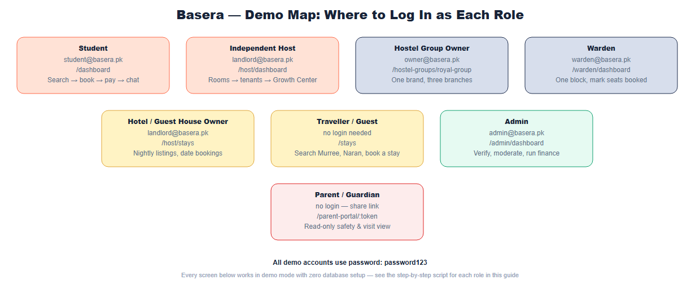
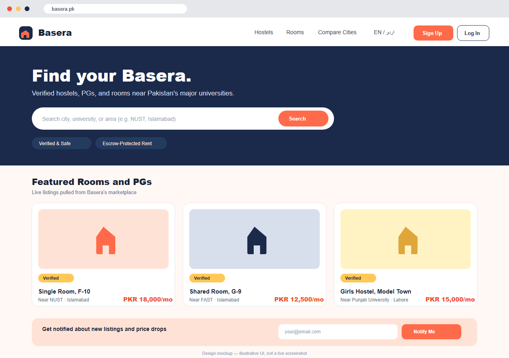
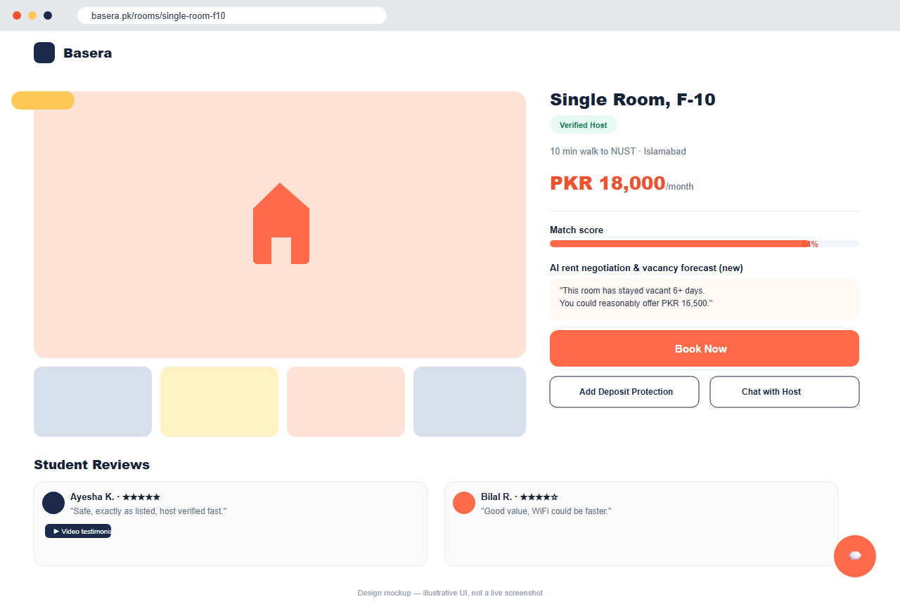

# Basera — Demo Guide for Every Role

*A plain-language, step-by-step walkthrough of what to show and say when demonstrating Basera to anyone — an investor, a potential host, a university administrator, or a family. No technical background needed. Every feature described below works today in "demo mode," with no database or setup required.*

---

## How to Use This Guide

Basera serves seven different kinds of people, and each one sees a different side of the same platform. Pick the role that matches who you're demoing to — or use the "Full Combined Demo Flow" at the end for a single 15–20 minute walkthrough that touches every role in one narrative.

**All demo accounts use the password `password123`.**

*Figure 1: Every role, its login, and where to find it.*

| Role | Login Email | Demo Entry Point |
|---|---|---|
| Student | `student@basera.pk` | `/dashboard` |
| Independent Host / Landlord | `landlord@basera.pk` | `/host/dashboard` |
| Hostel Group Owner | `owner@basera.pk` | `/hostel-groups/royal-group` |
| Warden | `warden@basera.pk` | `/warden/dashboard` |
| Hotel / Guest House Owner | `landlord@basera.pk` (same host login) | `/host/stays` |
| Admin | `admin@basera.pk` | `/admin/dashboard` |
| Parent / Guardian | *no login needed* | a share link generated by a student |

---

## Role 1: Student — "I need a safe place to live near my university"

**Who this is:** An outstation student or young professional moving to a new city for university or work, worried about being scammed, ending up with a bad roommate, or paying a deposit for a room that doesn't match its photos.

**What Basera solves for them:** A search experience where every listing carries real verification, rent is held safely until move-in, and — uniquely — they can see *what kind of person* they'd be rooming with before ever committing.

*Figure 2: The homepage — real listings, verification badges, and escrow messaging front and center.*

**Demo script:**
1. Open the homepage with no login. Point out the listings are real (pulled live from the platform, not placeholder content), and the "Verified & Safe" / "Escrow-Protected Rent" badges in the hero section.
2. Search a city or university (try "NUST" or "Royal" — the latter demonstrates Hostel Groups, surfacing every branch of a chain under one badge).
3. Open a room with existing occupants and scroll to the **Roommates panel**:

   
   *Figure 3: "Currently living here: 1 Working Professional — Mathematics Teacher — quiet, early sleeper, can help with calculus." No name, no contact info — just what a prospective tenant actually needs to decide.*

4. Log in as `student@basera.pk` and open the **Dashboard**:

   
   *Figure 4: Bookings, payments, roommate compatibility tools, and the AI-powered decision lab.*

5. Walk through starting a booking — point out that the host's phone/email stay hidden until payment, and the optional Deposit Protection add-on at checkout.
6. Open the AI concierge and ask something like *"What documents do I need to book a room?"* — if `CLAUDE_API_KEY` is configured, this is a real AI response, not a scripted chatbot.

**Be upfront if asked:** Deposit Protection is a real fee/claims flow on the platform side, but not yet backed by a licensed insurance underwriter.

---

## Role 2: Independent Host / Landlord — "I want to fill my rooms faster and get paid reliably"

**Who this is:** Someone who owns or manages one hostel, PG, or a handful of rooms and currently relies on word of mouth or informal listings.

**What Basera solves for them:** A dashboard that fills vacancies, prices rooms intelligently, and guarantees payment without them having to chase tenants for rent.

*Figure 5: Smart Pricing reasoning from real occupancy, comparable prices, and academic-calendar seasonality — not a flat guess.*

**Demo script:**
1. Log in as `landlord@basera.pk` and open the **Growth Center**.
2. Show the **Smart Pricing** card — explain that it reads out a plain-language explanation, not just a number, based on actual occupancy and nearby comparable prices.
3. Show the room inventory, tenant list, and finance/ledger view.
4. Point out the SaaS subscription tiers (Starter/Pro/Premium) for hosts who want more visibility and tools.

**Be upfront if asked:** SaaS tier pricing is still being finalized — don't quote specific PKR figures until the pricing page is published.

---

## Role 3: Hostel Group Owner — "I run multiple hostels under one brand"

**Who this is:** An owner or operator with several hostel branches across one or more cities, who wants to be recognized as a trusted, established brand rather than a series of unrelated listings.

**What Basera solves for them:** A single verified identity for the whole chain, so searching for the brand name surfaces every branch, and each branch benefits from the group's collective reputation.

*Figure 6: "Royal Group of Hostels" — one verified badge, three branches, all searchable by the group name.*

**Demo script:**
1. From the homepage, search **"Royal"** — every branch of Royal Group of Hostels appears in results.
2. Click through to `/hostel-groups/royal-group` to show the branded group page listing all branches with their own pricing and location.
3. Log in as `owner@basera.pk` to show the property listing flow a group owner uses to attach a new branch hostel to their existing group.

**The pitch to a real group owner:** "List your whole chain under one verified brand on Basera" — this is as much a B2B acquisition tool as a student-facing feature.

---

## Role 4: Warden — "I manage one block of a larger hostel day-to-day"

**Who this is:** Staff responsible for a specific physical section (block) of a larger property — not the owner, and not authorized to see or manage the rest of the property.

**What Basera solves for them:** A focused dashboard scoped only to their block, plus a way to record real-world situations (like a seat filled through an informal, off-platform arrangement) without needing the owner to re-list anything.

*Figure 7: The Warden Dashboard — assigned block only, with the manual seat-booked override.*

**Demo script:**
1. Log in as `warden@basera.pk` and open `/warden/dashboard` — note that only their assigned block's rooms and seats are visible (this is enforced by the server, not just hidden in the interface).
2. Demonstrate **Mark Seat Booked (Offline)**: click it on a vacant bed, enter a reason (e.g. *"family paid cash directly, verified on-site"*), and show it turn into the distinct amber "Booked Offline" state.
3. Click **Release** to show the action is fully reversible.

**The real-world problem this solves:** seats filled through informal arrangements no longer show as falsely available online, without needing a full re-listing cycle.

---

## Role 5: Hotel / Guest House Owner — "I rent out a property nightly, not monthly"

**Who this is:** An owner of a guest house, hotel, or short-stay property in a tourist destination (Murree, Naran, etc.) — a different business from student housing, but one that benefits from the same trust infrastructure.

**What Basera solves for them:** Access to the same verification and booking system as the student marketplace, tailored for nightly rates and date-range bookings instead of monthly rent.

*Figure 8: The Stays vertical — visually distinct from student listings, built for a different audience and intent.*

**Demo script:**
1. Navigate to `/stays` and search "Murree." Point out the nightly-rate cards, deliberately styled differently from the monthly student listings.
2. Open a property and show the date-range booking form.
3. Log in with the host account and open `/host/stays` to show the owner-facing manager for these listings.

**Be upfront if asked:** unlike the student flow, guest contact is shared at booking time rather than gated — a deliberate choice given the shorter, lower-risk nature of a 1–3 night stay, not an inconsistency.

---

## Role 6: Admin / Trust & Finance Ops — "I keep the whole platform honest"

**Who this is:** Internal Basera staff responsible for verifying new listings, resolving disputes, and monitoring the platform's finances.

**What Basera solves for them:** A command center for everything that keeps the marketplace trustworthy — without this role, none of the trust promises made to students and hosts would be enforceable.

**Demo script:**
1. Log in as `admin@basera.pk` and open `/admin/dashboard`.
2. Show the verification queue (new hosts/listings awaiting approval), the finance command room (escrow balances, payout approvals), and the dispute resolution workflow.
3. Show the trust center — moderation queues, review classification, and the incident timeline.

---

## Role 7: Parent / Guardian — "I want reassurance without micromanaging"

**Who this is:** A parent who wants visibility into their child's living situation without needing an account or having to personally verify anything.

**What Basera solves for them:** A read-only view, shared by the student on their own terms, showing safety-relevant information without requiring the parent to learn a new platform.

**Demo script:**
1. From the student dashboard, show the **Parent Share Link** feature being generated.
2. Open that link in a private/incognito window to show the parent's read-only view — safety summary, visit scheduling, no ability to message the host or make changes.
3. Note the bilingual English/Urdu toggle, which today is most fully built out on this specific portal.

---

## Full Combined Demo Flow (~15–20 minutes)

Use this sequence when presenting to a single audience that wants the whole story, not just one role:

1. **Open with the problem (2 min).** Land on the homepage with no login. Point out real listings and trust badges — this is the trust-first framing that differentiates Basera from informal Facebook-group room hunting.
2. **Search and discovery (2 min).** Show city/university filtering, the map view, and search "Royal" to demonstrate Hostel Groups.
3. **Roommate visibility — the differentiator (3 min).** Open a shared room, show the Roommates panel, then log in as a student to show how visibility is controlled (including the opt-out toggle).
4. **Booking and escrow (2 min).** Walk through starting a booking, contact gating, the Deposit Protection add-on, and the escrow explanation.
5. **Warden Dashboard — operational trust (2 min).** Show the manual seat-booked override and its reversibility.
6. **Host side: Growth Center (2 min).** Show Smart Pricing reasoning from real data.
7. **Hotels & Guest Houses — the new vertical (2 min).** Search "Murree," show the nightly booking flow.
8. **AI concierge (1 min).** Ask a real question and call out that it's a genuine AI response, not a script.
9. **Close on the mobile app and roadmap (2 min).** Mention the "Coming Soon" placeholders (rider booking, food ordering, job seeker) as visible proof the platform is built to grow.

---

## Things to Be Upfront About, Across Every Demo

- **Deposit Protection** is a real fee/opt-in/claims flow on the platform side, but not yet backed by a licensed insurance underwriter — say so plainly rather than overclaiming coverage.
- **AI-labeled scoring features** (DNA score, trust score, vacancy forecast) are legitimate deterministic calculations, not machine learning — only the concierge, listing-description, finance-anomaly, dispute-summary, and review-classifier features call a real AI model, and only when an API key is configured.
- **The mobile app** is a complete, real source tree, not yet installed, built, or published — a good one-liner: "the app is written and ready to run; the app-store submission is the next phase."
- **Hotel/guest-house guest contact** is shared at booking time (not gated like the long-term student flow) — a deliberate choice given the shorter, lower-risk nature of a short stay.

---

## If Presenting Against a Real Live Deployment

Confirm beforehand:
- The Railway backend health check returns OK: `https://basera-api-production.up.railway.app/api/v1/health`
- Demo data has been seeded (`npm run seed --prefix server`) so the accounts above actually exist in the live database rather than only in in-memory demo mode.
- The frontend at `https://basera-pk.netlify.app` loads real listings, not just the offline fallback.

See the **Development Master Plan** for the full deployment checklist if any of the above isn't yet true.
